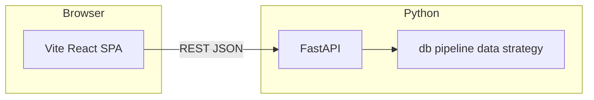

# React + FastAPI 前端重构设计说明

**状态：** 已定稿方向（待你书面确认 spec 后进入 implementation plan / 编码）

**分支：** `feature/frontend-vite-react-fastapi`

**决策摘要（已确认）：**

- 方案：**Vite + React（TypeScript）+ FastAPI**，不采用 Next.js（除非后续有 SSR/站点化强需求再评估）。
- 长任务（如「执行分析」）：**任务 ID + 客户端轮询任务状态**（方案 A）。
- 可视化：新前端图表统一 **Apache ECharts**（与项目约定一致）；与现有 Streamlit/Plotly 为替换关系，迁移期可只对齐关键图表后再逐步收口。
- UI：**第 6 节《UI 设计规范》** 定义 FinTech Light 令牌、应用壳层、组件与 ECharts 主题，实现时照抄变量与布局即可。
- 工程位置：在仓库内新增 **`frontend/`**（与 `stock_mvp/` 并列），避免与 Python 包结构混淆；构建产物由部署层或 FastAPI `StaticFiles` 挂载（实现阶段再定）。

---

## 1. 背景与目标

### 1.1 现状

- UI 集中在 `stock_mvp/app.py` 的 **Streamlit** 应用：侧栏配置、顶栏操作、**四大 Tab**（市场分析、板块分析、个股分析、评估报告），大量 `st.markdown(..., unsafe_allow_html=True)` 与内联样式。
- 数据与业务逻辑分散在 `db`、`data/*`、`pipeline`、`strategy/*` 等 Python 模块，与 Streamlit 会话状态耦合。

### 1.2 目标

- 将「展示与交互」迁到 **React SPA**，通过 **HTTP API** 消费后端能力。
- 将「读库、组装 DTO、触发 pipeline」收敛到 **FastAPI**，边界清晰，便于测试与演进。
- 部署上支持：**API 服务 + 静态前端**（开发时 Vite 代理到 API 亦可）。

---

## 2. 架构



- **前端**：路由或顶层 Tab 对齐现有四大模块；**视觉与交互以第 6 节《UI 设计规范》为准**（FinTech Light、Design Tokens、壳层与 ECharts 主题）。
- **后端**：FastAPI 应用入口独立模块（例如 `stock_mvp/api/` 或 `stock_mvp/webapi/`），**不**把业务逻辑堆在路由函数内，而是调用现有函数/新增薄 service 层。
- **跨域**：开发环境配置 CORS；生产可由反向代理同源，减少 CORS 暴露面。

---

## 3. 长任务与轮询（方案 A）

### 3.1 行为约定

- 用户触发「执行分析」类操作时：API **立即**返回 `{ "task_id": "...", "status": "queued"|"running" }`（HTTP 202 或 200 + 明确字段，实现时二选一并全文一致）。
- 客户端使用 **`GET /tasks/{task_id}`**（或等价路径）轮询，直到 `status` 为 `success` | `failed` | `cancelled`。
- 响应体包含：**进度文案或百分比（可选）**、**错误信息（failed 时）**、**完成后可拉取的资源摘要**（如最新 `trade_date`、关键报表版本号等），避免轮询结束后前端再盲猜状态。

### 3.2 服务端任务存储

- **MVP**：进程内内存 dict + `asyncio` 后台任务（单 worker 可用；多 worker 需 sticky session 或外存任务表，**不在本设计 MVP 范围**，仅在文档中列为后续风险）。
- **后续增强**：SQLite/Redis 任务表、取消任务、多实例一致。

### 3.3 与现有 Streamlit 逻辑对齐

- 现有「定时/自动刷新」「执行分析」等与 `st.session_state`、`st.rerun` 绑定的行为，改为：**显式 API 触发 + 轮询**；自动刷新改为前端 `setInterval` 调只读接口刷新市场快照（间隔可配置），**不再整页 reload**。

---

## 4. API 形态（草案，实现时可微调）

按现有 Tab 切分只读资源与写操作（名称仅为示意）：

| 能力 | 方法 | 说明 |
|------|------|------|
| 健康检查 | GET `/health` | 部署探活 |
| 最新市场快照 | GET `/api/market/latest` | 对应市场分析主数据 |
| 板块分析视图数据 | GET `/api/sectors/...` | 路径与分页实现阶段定 |
| 个股信号视图数据 | GET `/api/signals/...` | 同上 |
| 评估报告数据 | GET `/api/evaluation/...` | 同上 |
| 触发收盘分析 | POST `/api/jobs/analysis` | 返回 `task_id` |
| 任务状态 | GET `/api/jobs/{task_id}` | 轮询 |

配置类（数据源开关等）：首版可 **GET/PUT `/api/settings`** 或拆细；需与 `config` / DB 现状对齐，避免双写不一致。

**认证**：当前 Streamlit 若无私有认证，API MVP 可默认 **同网信任**；若暴露公网，必须在实现计划中增加 **至少 API Key 或反向代理鉴权**，不默认裸奔。

---

## 5. 前端模块映射

| Streamlit Tab | React 侧 |
|---------------|----------|
| 市场分析 | 页面：概览、指数、词云/新闻卡片等子区块 |
| 板块分析 | 页面：板块卡片栅格、涨跌分区 |
| 个股分析 | 页面：个股列表/卡片、信号展示 |
| 评估报告 | 页面：回测/持仓/交易流水等（与现有 `render_evaluation_report` 对齐） |

侧栏能力（执行分析、数据源、自动刷新间隔等）迁移为：**固定侧边栏** + 调用上述 API；四大模块导航也放入侧边栏作为主导航入口。

---

## 6. UI 设计规范（实现前对齐）

**设计关键词：** 轻量金融科技（FinTech Light）、高信息密度、冷静配色、涨跌语义色一致。与当前 `app.py` 中 `custom_css` 变量 **1:1 延续**，避免换框架后「像另一个产品」。

### 6.1 设计令牌（Design Tokens）

在 `frontend` 中以 **CSS 自定义属性** 定义全局 `:root`，实现时可直接照抄下列值。

| Token | 值 | 用途 |
|--------|-----|------|
| `--bg-primary` | `#f8fafc` | 页面底色 |
| `--bg-secondary` | `#f1f5f9` | Tab 轨道、次要区块底 |
| `--bg-tertiary` | `#e2e8f0` | 分隔、禁用底 |
| `--bg-card` | `#ffffff` | 卡片、面板 |
| `--bg-card-hover` | `#fafafa` | 卡片悬停 |
| `--border-color` | `#e2e8f0` | 默认描边 |
| `--border-strong` | `#cbd5e1` | 悬停/强调描边 |
| `--text-primary` | `#1e293b` | 标题、正文主色 |
| `--text-secondary` | `#64748b` | 说明、标签 |
| `--text-muted` | `#94a3b8` | 占位、弱化 |
| `--accent-green` | `#10b981` | 涨、正向 Delta |
| `--accent-green-dim` | `rgba(16,185,129,0.1)` | 涨区背景条 |
| `--accent-red` | `#ef4444` | 跌、负向 Delta |
| `--accent-red-dim` | `rgba(239,68,68,0.1)` | 跌区背景条 |
| `--accent-blue` | `#3b82f6` | 主按钮、选中 Tab、链接 |
| `--accent-cyan` | `#0891b2` | 链接悬停 |
| `--accent-gold` | `#f59e0b` | 强调提示（少用） |
| `--accent-purple` | `#8b5cf6` | 次要高亮 |
| `--shadow-sm/md/lg` | （同现有 CSS） | 卡片与 Tab 选中态 |

**圆角：** 卡片与 Alert `8px`；输入、次级按钮、Tab 内 pill `6px`。  
**间距：** 基准 `4px` 网格；区块纵向间距优先 `12px` / `16px`；页面左右内边距与 Streamlit `block-container` 紧凑风格一致（约 `16px`～`24px`）。

### 6.1.1 主题切换（浅色 / 深色 / 跟随系统）

**目标：** 支持背景与整体 UI 在「浅色」「深色」「系统」三种模式间切换，并确保涨跌语义色在深色下仍可读。

- **入口位置：** 侧边栏「设置区块」新增 **主题** 选项：`浅色 / 深色 / 跟随系统`。
- **持久化：** 前端使用 `localStorage` 保存用户选择；`跟随系统` 时监听 `prefers-color-scheme` 变化并即时切换。
- **实现方式：** 通过 `html` 或 `body` 挂载属性，例如 `data-theme="light|dark"`；令牌按主题覆盖，业务组件只引用令牌，不硬编码颜色。

**浅色主题（默认）**：沿用本节表格中现有值（与 Streamlit 现版一致）。

**深色主题（新增一组覆盖值，保持 FinTech 质感但不刺眼）**：

| Token | 值 | 说明 |
|--------|-----|------|
| `--bg-primary` | `#0b1220` | 页面底色（深蓝黑） |
| `--bg-secondary` | `#0f1a2e` | 次级底（侧边栏分组/小面板底） |
| `--bg-tertiary` | `#13223b` | 分隔/禁用底 |
| `--bg-card` | `#0f172a` | 卡片底（接近 slate-900） |
| `--bg-card-hover` | `#111d34` | 卡片悬停 |
| `--border-color` | `#1e2a44` | 默认描边 |
| `--border-strong` | `#2a3a5f` | 强调描边 |
| `--text-primary` | `#e5e7eb` | 主文字 |
| `--text-secondary` | `#a1a9b8` | 次文字 |
| `--text-muted` | `#7b879b` | 弱化 |
| `--accent-blue` | `#60a5fa` | 主操作/选中（深色更亮） |
| `--accent-cyan` | `#22d3ee` | 链接悬停 |
| `--accent-green` | `#34d399` | 涨色 |
| `--accent-green-dim` | `rgba(52, 211, 153, 0.14)` | 涨区淡底（深色提高不透明度） |
| `--accent-red` | `#fb7185` | 跌色（偏玫红，深色更柔） |
| `--accent-red-dim` | `rgba(251, 113, 133, 0.14)` | 跌区淡底 |
| `--shadow-sm` | `0 1px 2px rgba(0,0,0,0.35)` | 深色阴影更实 |
| `--shadow-md` | `0 8px 20px rgba(0,0,0,0.35)` |  |
| `--shadow-lg` | `0 18px 40px rgba(0,0,0,0.45)` |  |

**注意：** 深色下不建议使用纯黑与纯白；所有面板以 `--bg-card` 为基准分层，边框承担分割作用，减少“发灰一坨”的观感。

### 6.2 字体与排版

| 用途 | 字体 | 说明 |
|------|------|------|
| 中文 UI | `Noto Sans SC`, system-ui | 标题字重 600；正文 400/500 |
| 数字、代码、指标 | `JetBrains Mono`, monospace | 价格、涨跌幅、表格数字列 |

**字号阶梯（与现版接近）：** 页标题 `1.5rem`；区块标题 `1.1rem`～`1.25rem`；正文 `13px`～`14px`；指标大卡数字 `18px`；辅助标签 `11px`、大写+微字距（等同 `stMetricLabel` 风格）。

### 6.3 应用壳层（App Shell）

```
┌──────────────────────────────────────────────────────────────────────────┐
│ 侧边栏（固定）                         │ 主内容区（--bg-primary）           │
│ ┌ 品牌：股民间投资助手                  │ ┌ 顶部：页面标题 / 状态（可选）      │
│ ├ 主导航：市场/板块/个股/评估           │ ├ 内容：卡片铺排 / 图表 / 表格      │
│ ├ 主操作：[执行分析]（Primary）         │ │   ┌ 区块标题：涨绿/跌红左侧条       │
│ ├ 自动刷新：开关 + 间隔                │ │   └ 业务区块（新闻卡/板块卡/列表）  │
│ ├ 数据源：多选/开关                    │ └───────────────────────────────────┘
│ └ AI：开关（若保留）                   │
└──────────────────────────────────────────────────────────────────────────┘
```

- **侧边栏：** 固定宽度 `280px`～`320px`（默认 300），背景 `--bg-card`，右侧 1px 边框 `--border-color`；信息密度对齐当前 Streamlit 侧栏（`13px` 字号、紧凑间距）。侧边栏承载「模块导航 + 运行/设置」两类能力：\n+  - **主导航（四大模块）**：`市场分析 / 板块分析 / 个股分析 / 评估报告` 作为侧边栏顶部的主导航列表；选中态使用 `--accent-blue` 的浅底（或左侧高亮条）+ 主文字 `--text-primary`；未选中为 `--text-secondary`。\n+  - **执行分析区块**：显示轮询任务状态（`queued/running/success/failed`）、开始时间、最近一次完成时间；运行中禁用按钮，避免重复触发。\n+  - **设置区块**：自动刷新开关与间隔、数据源开关、AI 开关、（可选）“仅更新实时数据”等。\n+- **主内容区：** 顶部不再使用 Tab 轨道；改为当前页面标题（例如「市场分析」）+ 可选的状态副标题（日期/刷新时间）。页面横向 padding 保持紧凑（`16px`～`24px`）。在宽屏下卡片栅格优先 2～4 列；窄屏降为 1 列。

### 6.4 组件规格摘要

| 组件 | 规格 |
|------|------|
| **主按钮** | 背景 `--accent-blue`，白字，`border-radius: 6px`，`padding: 8px 16px`，悬停 `#2563eb` + `shadow-md` |
| **次按钮** | 白底、 `--border-color` 描边，悬停底 `--bg-secondary`、描边 `--accent-blue` |
| **指标卡（Metric）** | 白底、细边框、`8px` 圆角、`12px 16px` 内边距；标签 uppercase 小字；数值 JetBrains Mono |
| **信息提示** | Info：`rgba(59,130,246,0.08)` 底 + 蓝色系描边（与现有 `stAlert` 一致）；Success/Warning/Error 沿用现 CSS 语义 |
| **新闻/板块卡片** | 白底卡片 + `shadow-sm`；链接 `--accent-blue` → 悬停 `--accent-cyan` |
| **表格** | 斑马纹可选；表头 `--text-secondary`；数字列右对齐、等宽字体 |

### 6.5 ECharts 主题（与令牌对齐）

在 `frontend` 封装统一 `echarts.init` 前注入 **theme 对象**（或 JSON theme），与 Design Tokens 一致，避免图表与 UI 脱节：

- **背景：** 透明或 `--bg-card`，网格线 `--border-color`。
- **类目轴文字：** `--text-secondary`；**数值轴：** JetBrains Mono。
- **系列默认色：** 主序列 `--accent-blue`；辅助序列 `--accent-cyan` / `--accent-purple`。
- **涨/跌系列：** 涨 `--accent-green`，跌 `--accent-red`；K 线若存在则实心/空心规则与行业习惯一致即可。
- **tooltip：** 背景 `#fff`，边框 `--border-color`，文字 `--text-primary`。

**主题切换要求：** 当 `data-theme` 变化时，ECharts 必须同步换肤：\n
- 简化策略：统一在图表容器组件里监听主题变化，销毁并重建实例（首版可接受，避免大量 option merge 的边界问题）。\n
- 细化策略（后续可选）：仅更新 `backgroundColor`、`textStyle`、`axisLine/axisLabel`、`splitLine`、`tooltip` 等 theme 相关配置并 `setOption` 合并更新。

### 6.6 交互与无障碍（MVP 底线）

- **焦点：** 可聚焦控件具备可见 `outline` 或 `box-shadow`（与现输入框 `2px` 蓝环一致）。
- **加载：** 区块级 `Skeleton` 或轻量 `Spinner`，避免整页白屏；轮询任务时禁用重复提交「执行分析」。
- **响应式：** 首版以 **桌面宽屏** 为主（对齐当前 `layout="wide"`）；中窄屏允许 Tab 横向滚动、卡片改为单列。
  - 由于四大模块导航已移至侧边栏，窄屏下优先将侧边栏变为“可折叠抽屉”（左上角汉堡按钮），避免主内容被挤压。

### 6.7 与实现计划的衔接

实现阶段第一步在 `frontend/src/styles/tokens.css`（或等价）落盘上述变量；壳层组件为 `AppSidebar`（含主导航）、`AppLayout`（主布局容器）、`PageHeader`（页面标题/状态，可选）按本节施工；图表统一通过 `useEchartsTheme()`（或常量）注册，**禁止**在业务页散落硬编码色值。

---

## 7. 测试策略

- **Python**：为 FastAPI 路由增加 **异步客户端测试**（`httpx.AsyncClient` + `TestClient`），覆盖任务创建与轮询状态机；核心 pipeline 保持现有 `tests/` 覆盖。
- **前端**：Vitest 测 hooks/纯函数；关键流程可选 Playwright（实现阶段按需）。

---

## 8. 迁移与兼容

- **Streamlit**：新栈可运行后，保留 `app.py` 一段时间作为回退或仅文档说明「已废弃」，删除时机在实现计划尾声与用户确认。
- **依赖**：`requirements.txt` 增加 `fastapi`、`uvicorn[standard]` 等；前端独立 `package.json`，**不在未说明情况下**在根目录复制多份 node 工程。

---

## 9. 自检（spec 质量）

- [x] 无 TBD 占位：多 worker 任务一致性标为后续风险，非占位。
- [x] 与已确认方案一致：Vite+React+FastAPI、轮询任务 A。
- [x] 范围：MVP 为单进程任务存储 + 四大模块 API 化 + 前端壳与主路径打通。
- [x] UI：第 6 节已给出 Design Tokens、壳层、组件与 ECharts 对齐规则。

---

**下一步：** 你确认本文件无异议后，编写 `2026-04-20-react-fastapi-frontend-implementation-plan.md`（分任务、文件清单、测试与提交粒度），再开始脚手架与 API 拆解实现。
