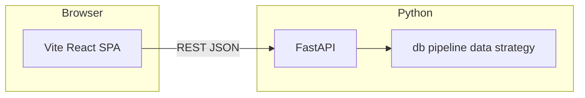

# React + FastAPI 前端重构设计说明

**状态：** 已定稿方向（待你书面确认 spec 后进入 implementation plan / 编码）

**分支：** `feature/frontend-vite-react-fastapi`

**决策摘要（已确认）：**

- 方案：**Vite + React（TypeScript）+ FastAPI**，不采用 Next.js（除非后续有 SSR/站点化强需求再评估）。
- 长任务（如「执行分析」）：**任务 ID + 客户端轮询任务状态**（方案 A）。
- 可视化：新前端图表统一 **Apache ECharts**（与项目约定一致）；与现有 Streamlit/Plotly 为替换关系，迁移期可只对齐关键图表后再逐步收口。
- 工程位置：在仓库内新增 **`frontend/`**（与 `stock_mvp/` 并列），避免与 Python 包结构混淆；构建产物由部署层或 FastAPI `StaticFiles` 挂载（实现阶段再定）。

---

## 1. 背景与目标

### 1.1 现状

- UI 集中在 `stock_mvp/app.py` 的 **Streamlit** 应用：侧栏配置、顶栏操作、**四大 Tab**（市场分析、板块分析、个股分析、评估报告），大量 `st.markdown(..., unsafe_allow_html=True)` 与内联样式。
- 数据与业务逻辑分散在 `db`、`data/*`、`pipeline`、`strategy/*` 等 Python 模块，与 Streamlit 会话状态耦合。

### 1.2 目标

- 将「展示与交互」迁到 **React SPA**，通过 **HTTP API** 消费后端能力。
- 将「读库、组装 DTO、触发 pipeline」收敛到 **FastAPI**，边界清晰，便于测试与演进。
- 部署上支持：**API 服务 + 静态前端**（开发时 Vite 代理到 API 亦可）。

---

## 2. 架构

- **前端**：路由或顶层 Tab 对齐现有四大模块；全局样式复刻现有 FinTech Light 主题（建议 CSS 变量 + 组件库按需选型，实现阶段再定）。
- **后端**：FastAPI 应用入口独立模块（例如 `stock_mvp/api/` 或 `stock_mvp/webapi/`），**不**把业务逻辑堆在路由函数内，而是调用现有函数/新增薄 service 层。
- **跨域**：开发环境配置 CORS；生产可由反向代理同源，减少 CORS 暴露面。

---

## 3. 长任务与轮询（方案 A）

### 3.1 行为约定

- 用户触发「执行分析」类操作时：API **立即**返回 `{ "task_id": "...", "status": "queued"|"running" }`（HTTP 202 或 200 + 明确字段，实现时二选一并全文一致）。
- 客户端使用 **`GET /tasks/{task_id}`**（或等价路径）轮询，直到 `status` 为 `success` | `failed` | `cancelled`。
- 响应体包含：**进度文案或百分比（可选）**、**错误信息（failed 时）**、**完成后可拉取的资源摘要**（如最新 `trade_date`、关键报表版本号等），避免轮询结束后前端再盲猜状态。

### 3.2 服务端任务存储

- **MVP**：进程内内存 dict + `asyncio` 后台任务（单 worker 可用；多 worker 需 sticky session 或外存任务表，**不在本设计 MVP 范围**，仅在文档中列为后续风险）。
- **后续增强**：SQLite/Redis 任务表、取消任务、多实例一致。

### 3.3 与现有 Streamlit 逻辑对齐

- 现有「定时/自动刷新」「执行分析」等与 `st.session_state`、`st.rerun` 绑定的行为，改为：**显式 API 触发 + 轮询**；自动刷新改为前端 `setInterval` 调只读接口刷新市场快照（间隔可配置），**不再整页 reload**。

---

## 4. API 形态（草案，实现时可微调）

按现有 Tab 切分只读资源与写操作（名称仅为示意）：

| 能力 | 方法 | 说明 |
|------|------|------|
| 健康检查 | GET `/health` | 部署探活 |
| 最新市场快照 | GET `/api/market/latest` | 对应市场分析主数据 |
| 板块分析视图数据 | GET `/api/sectors/...` | 路径与分页实现阶段定 |
| 个股信号视图数据 | GET `/api/signals/...` | 同上 |
| 评估报告数据 | GET `/api/evaluation/...` | 同上 |
| 触发收盘分析 | POST `/api/jobs/analysis` | 返回 `task_id` |
| 任务状态 | GET `/api/jobs/{task_id}` | 轮询 |

配置类（数据源开关等）：首版可 **GET/PUT `/api/settings`** 或拆细；需与 `config` / DB 现状对齐，避免双写不一致。

**认证**：当前 Streamlit 若无私有认证，API MVP 可默认 **同网信任**；若暴露公网，必须在实现计划中增加 **至少 API Key 或反向代理鉴权**，不默认裸奔。

---

## 5. 前端模块映射

| Streamlit Tab | React 侧 |
|---------------|----------|
| 市场分析 | 页面/Tab：概览、指数、词云/新闻卡片等子区块 |
| 板块分析 | 板块卡片栅格、涨跌分区 |
| 个股分析 | 个股列表/卡片、信号展示 |
| 评估报告 | 回测/持仓/交易流水等（与现有 `render_evaluation_report` 对齐） |

侧栏能力（执行分析、数据源、自动刷新间隔等）迁移为：**顶栏或抽屉设置面板** + 调用上述 API。

---

## 6. 测试策略

- **Python**：为 FastAPI 路由增加 **异步客户端测试**（`httpx.AsyncClient` + `TestClient`），覆盖任务创建与轮询状态机；核心 pipeline 保持现有 `tests/` 覆盖。
- **前端**：Vitest 测 hooks/纯函数；关键流程可选 Playwright（实现阶段按需）。

---

## 7. 迁移与兼容

- **Streamlit**：新栈可运行后，保留 `app.py` 一段时间作为回退或仅文档说明「已废弃」，删除时机在实现计划尾声与用户确认。
- **依赖**：`requirements.txt` 增加 `fastapi`、`uvicorn[standard]` 等；前端独立 `package.json`，**不在未说明情况下**在根目录复制多份 node 工程。

---

## 8. 自检（spec 质量）

- [x] 无 TBD 占位：多 worker 任务一致性标为后续风险，非占位。
- [x] 与已确认方案一致：Vite+React+FastAPI、轮询任务 A。
- [x] 范围：MVP 为单进程任务存储 + 四大模块 API 化 + 前端壳与主路径打通。

---

**下一步：** 你确认本文件无异议后，编写 `2026-04-20-react-fastapi-frontend-implementation-plan.md`（分任务、文件清单、测试与提交粒度），再开始脚手架与 API 拆解实现。
